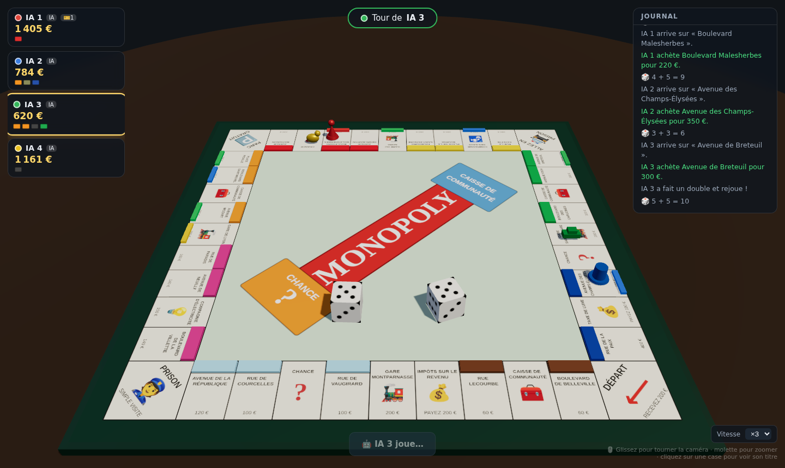

# 🎩 Monopoly 3D

Un jeu de Monopoly complet dans le navigateur, avec un plateau 3D rendu en WebGL (Three.js). Jouez contre des IA, entre humains, ou en mode mixte — sur le même appareil.



## 🚀 Lancer le jeu

```bash
npm install
npm run dev
```

Puis ouvrez l'adresse affichée (par défaut http://localhost:5173).

Pour une version de production :

```bash
npm run build
npm run preview
```

## 🎮 Fonctionnalités

- **Plateau 3D interactif** : caméra orbitale (glisser pour tourner, molette pour zoomer), dés 3D animés, pions qui sautent de case en case, maisons et hôtels en relief.
- **2 à 6 joueurs**, chacun humain 🧑 ou IA 🤖 — toutes les combinaisons sont possibles (y compris une partie 100 % IA à regarder).
- **Règles classiques** (édition française) :
  - Achat de terrains, gares et compagnies, perception des loyers (doublés sur groupe complet).
  - Construction de maisons et d'hôtels (règle de construction uniforme).
  - Hypothèques et levées d'hypothèque (+10 %).
  - Cartes Chance et Caisse de Communauté.
  - Prison : payer 50 €, carte « Libéré de prison » ou tenter un double (3 essais).
  - Trois doubles consécutifs = prison.
  - Faillites : les biens reviennent au créancier, dernier joueur en lice gagne.
- **IA à heuristiques** : achète en priorité ce qui complète ses groupes ou bloque les vôtres, construit sur ses monopoles, gère ses liquidités (hypothèque/vend en cas de besoin), choisit sa stratégie de sortie de prison selon l'avancement de la partie.
- **Confort** : journal de partie, titres de propriété consultables en cliquant sur les cases, vitesse de jeu réglable (×1 à ×3).

## 🧱 Architecture

```
src/
├── game/
│   ├── data.js      # Plateau (40 cases, édition française), constantes
│   ├── cards.js     # Cartes Chance & Caisse de Communauté
│   ├── engine.js    # Moteur de règles (tours, loyers, prison, faillites…)
│   └── ai.js        # Heuristiques des joueurs IA
├── 3d/
│   └── scene.js     # Scène Three.js : plateau, pions, dés, animations
├── ui/
│   ├── ui.js        # HUD, modales, journal
│   └── styles.css
└── main.js          # Configuration de partie + liaison moteur ↔ 3D ↔ UI
```

Le moteur de jeu est découplé du rendu : il communique via une interface `view` asynchrone, ce qui permet de synchroniser les règles avec les animations 3D et les choix des joueurs.

## 📝 Limites connues (simplifications volontaires)

- Pas d'enchères quand un joueur refuse d'acheter (règle officielle rarement jouée).
- Pas d'échanges de propriétés entre joueurs.
- Stock de maisons illimité.
